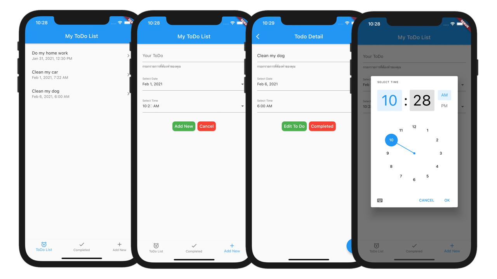

# SimpleToDoList

พัฒนาโดย 

[อาจาย์พิศาล สุขขี](https://www.facebook.com/numvarn)

phisan.s@sskru.ac.th

สาขาวิทยาการคอมพิวเตอร์, คณะศิลปศาสตร์และวิทยาศาสตร์ มหาวิทยาลัยราชภัฏศรีสะเกษ

**Packages we are using:**

- path_provider: [link](https://pub.dev/packages/path_provider)

**Description:**

โปรแกรม Simple Todo List หรือ โปรแกรมบันทึกสิ่งที่ต้องทำอย่างง่าย ใช้การบันทึก - อ่านข้อมูลแบบ JSON แบบ Local เพื่อบันทึกข้อมูลสิ่งต่าง ๆ ที่ต้องทำเอาไว้

เป็นโปรแกรมเพื่อใช้สำหรับการสาธิตให้นักศึกษาได้เรียนรู้ และเข้าใจในเรื่องการการสร้่างข้อมูลให้อยู่ในรูปแบบโครงสร้่างของ JSON และการ อ่าน - เขียน ไฟล์ในโมบายแอบพลิเคชั่น

โมบายแอปพลิเคชั่นนี้พัฒนาขึ้นเพื่อใช้เป็นสื่อการเรียนการสอน และตัวอย่างในกรณีศึกษาการพัฒนาโมบายแอปพลิเคชั่นด้วย Flutter ในรายวิชาการพัฒนาโปรแกรมบนมือถือ

เพื่อให้นักศึกษาได้ใช้สำหรับการศึกษา ทดลองปฏิบัติตาม ให้เกิดความรู้ ความเข้าใจ และทักษะในการพัฒนาโปรแกรมบนมือถือด้วย Flutter

## การอ่าน - เขียนไฟล์ด้วย Flutter

```dart
import 'dart:io';
import 'package:path_provider/path_provider.dart';

// Class for read/write User Todo json file
class ToDoFileProcess {
  Future<String> get _localPath async {
    final directory = await getApplicationDocumentsDirectory();
    return directory.path;
  }

  Future<File> get _localFile async {
    final path = await _localPath;
    return File('$path/todo.json');
  }

  Future<String> readTodo() async {
    try {
      final file = await _localFile;
      String contents = await file.readAsString();
      return contents.toString();
    } catch (e) {
      return 'fail';
    }
  }

  Future<File> writeTodo(String data) async {
    final file = await _localFile;
    return file.writeAsString('$data');
  }
} //end class
```

การอ่านข้อมูลจากไฟล์

```dart
// Crate file processor object
ToDoFileProcess fileProcess = ToDoFileProcess();

// Read data from file
String todoStr = await fileProcess.readTodo();

// Convert string to Json Object
jsonData = json.decode(todoStr);
```

การเขียนบันทึกข้อมูลลงไฟล์ในรูปแบบ JSON
- นำข้อมูลมาใส่ในโครงสร้าง MAP
- นำ MAP มาบรรจุไว้ใน List
- แปลง List ให้กลายเป็น Json Object
- แปลง Json Object ให้เป็นสตริงและเขียนลงไฟล์

```dart
List<Map> list = [];

Map<String, dynamic> existTodo = {
    'id': item['id'],
    'title': item['title'],
    'date': item['date'],
    'time': item['time'],
    'status': item['status']
};

list.add(existTodo);

// Convert list to JSON
var todo = jsonEncode(list);

// Write Json to file
fileProcess.writeTodo(todo.toString());
```

## ตัวอย่างหน้าจอ User Interface



